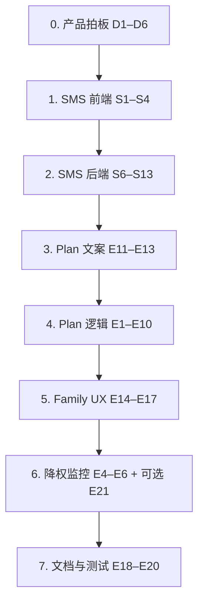

# 订阅权益对齐 & SMS 移除 — 改动清单

**版本**：1.1  
**日期**：2026-06-02  
**实施状态**：已完成（2026-06-02）
**背景**：对照 [REQUIREMENTS-CLIENT.md](./REQUIREMENTS-CLIENT.md) 与 `components/billing/PlanCards.tsx` 卖点；当前仅 **药品数 / 家庭成员数** 按 plan 强制，即时邮件、批号、SMS 等未分层。产品已决定 **现阶段不提供 SMS**，需从前端与后端清理残留。

---

## 0. 实施前先拍板（产品决策）

| # | 问题 | 建议方案 A（与 UpgradeModal 一致） | 方案 B（与当前 PlanCards Free 文案一致） |
|---|------|-----------------------------------|----------------------------------------|
| D1 | **Free** 邮件能力 | 仅 **Daily digest**；无即时单条召回邮件 | Digest + 可选 Instant（与现 PlanCards 一致） |
| D2 | **Personal Pro** 邮件 | **Instant** + 可选 Digest | 同左 |
| D3 | **批号匹配** | 全用户可用（仅作数据质量，不锁 plan） | 仅 Personal+ 在表单展示/保存 `lot_number` |
| D4 | **降权后超限药品** | 仅 **最早添加的 N 条** `active` 继续监控（N=当前 plan 上限），其余 `paused` 或停止匹配 | 保留全部 active，仅禁止新增（现状） |
| D5 | **Family「共享看板」** | Dashboard 按成员分组 + 未读计数 | 仅加导航入口 + 药箱列表显示成员名 |
| D6 | **定价页 FAQ「化妆品/食品」** | 删除或改为「不在当前版本」 | 保留 Coming soon |

**已确认（2026-06-02）**：全部采用方案 A（D5 为方案 B：导航 + 药箱成员名，无 Dashboard 按成员汇总）。

---

## 1. 订阅权益 — 建议目标行为（拍板后写入代码）

| 能力 | Free | Personal Pro | Family Protection |
|------|------|--------------|-------------------|
| 监控药品上限 | 2 | 20 | 50 |
| 家庭成员 | 0 | 0 | 5 |
| 即时召回邮件 | ❌（若采用 D1-A） | ✅ | ✅ |
| 每日 Digest 邮件 | ✅ | ✅（可关） | ✅ |
| 站内通知 | ✅ | ✅ | ✅ |
| 批号字段与匹配 | ✅（建议全员） | ✅ | ✅ |
| SMS | ❌（已移除） | ❌ | ❌ |
| 家庭页 / 成员归属 | ❌ | ❌ | ✅ |

---

## 2. 订阅权益 — 具体改动清单

### P0 — 权益与合同一致

| ID | 文件 / 模块 | 改动内容 |
|----|-------------|----------|
| E1 | `lib/plan.ts` | 新增能力判断，例如：`hasPaidPlan(plan)`、`canReceiveInstantEmail(plan)`、`canManageFamily(plan)`、`medQuota(plan)`；集中导出，避免散落字符串比较。 |
| E2 | `lib/notification-dispatcher.ts` | 发送即时邮件前读取用户 `getEffectivePlan`；Free 用户跳过即时通道（仍将 `email_sent_at` 标为已处理或留给 digest，避免重复队列）。 |
| E3 | `lib/daily-digest.ts` | 确认 Free 仍收 digest；若 Free 不应收任何邮件，在此加 plan 判断（与 D1 一致）。 |
| E4 | `lib/matching.ts` + 新建 `lib/plan-enforcement.ts`（可选） | `scanAllActiveItems` / `notifyMatchesForItem` 仅处理「在配额内」的 active 药品：按 `added_at` 排序取前 `QUOTAS[plan].meds` 条；或在降权时把超出项标为 `status: 'paused'`（需 migration，见 E12）。 |
| E5 | `lib/stripe-billing.ts` → `revokePaidAccess` | 降权后调用 E4 逻辑（暂停超限监控或停止为新通知建 row）。 |
| E6 | `lib/subscription-ended.ts` | 订阅结束时与 E5 相同处理。 |
| E7 | `app/api/cabinet/route.ts` POST | 已有 `enforceMedQuota` ✅；降权后若用户删除药再添加，行为保持即可。 |
| E8 | `app/api/family/route.ts` | 已有 `enforceFamilyQuota` ✅；可选：GET 对 non-family plan 返回 403 或空列表（避免误用）。 |
| E9 | `components/settings/PreferencesForm.tsx` | **Instant / Digest 开关按 plan 展示**：Free 隐藏 Instant 或显示为 disabled + 链到 `/pricing`；付费显示两项。 |
| E10 | `app/api/preferences/route.ts` | PATCH 时校验：Free 不可将 `email_instant_enabled` 设为 true（服务端硬校验，防篡改）。 |

### P1 — 产品文案与 UX

| ID | 文件 | 改动内容 |
|----|------|----------|
| E11 | `components/billing/PlanCards.tsx` | 更新 bullets：去掉 SMS；Free / Personal / Family 与 §1 表一致；Family 去掉未实现的「Shared monitoring dashboard」或改为「Per-member cabinets」。 |
| E12 | `components/billing/UpgradeModal.tsx` | 统一文案（instant 仅 Personal+；Family 强调成员与 50 药）。 |
| E13 | `app/(public)/pricing/page.tsx` | FAQ：删除或改写「化妆品/食品仅 Family」条目（D6）。 |
| E14 | `components/AppShell.tsx` | 登录用户 `plan === 'family'` 时显示 **Family** 导航链到 `/family`（或所有付费用户可见但点击非 family 时引导升级）。 |
| E15 | `app/(app)/cabinet/page.tsx` | 列表 `select` 增加 `member_id` + join `family_members.display_name`；按成员分组或显示标签。 |
| E16 | `app/(app)/dashboard/page.tsx` | Family plan：按成员汇总 active 药数 / 未读通知（最小版「共享看板」）。 |
| E17 | `app/(app)/family/page.tsx` | 非 family plan 访问时展示升级 CTA（服务端 `getEffectivePlan`），而非空表单。 |

### P2 — 文档与验收

| ID | 文件 | 改动内容 |
|----|------|----------|
| E18 | `docs/IMPLEMENTATION-COMPARISON.md` | 更新 SUB-03 / Stripe / dispatcher 已接入现状；SMS 标为已移除。 |
| E19 | `docs/REQUIREMENTS-CLIENT.md`（可选） | 若客户书面放弃 V2-9 SMS，在附录注明「本期不含 SMS」避免验收争议。 |
| E20 | 测试 | 为 `lib/plan.ts` 能力函数 + preferences API plan 校验 + matching 配额截断各加单元测试。 |

### 可选 DB（仅当采用「paused」策略时）

| ID | 文件 | 改动内容 |
|----|------|----------|
| E21 | `supabase/migrations/00xx_medication_paused.sql` | `medication_items.status` 增加 `paused`；降权脚本将超出配额项设为 `paused`；`scanAllActiveItems` 仅 `active`。 |

---

## 3. SMS 移除 — 清理清单

> **原则**：前端先清干净用户可见入口；后端去掉发送逻辑与依赖；**DB 列可保留**（避免迁移风险），不再读写即可。

### 3.1 前端 / 用户可见（优先）

| ID | 文件 | 操作 |
|----|------|------|
| S1 | `components/settings/PreferencesForm.tsx` | 删除 **SMS** `Toggle`、手机号输入、`sms_enabled` / `phone_number` 状态字段与默认值。 |
| S2 | `components/billing/PlanCards.tsx` | 删除 Personal Pro bullet：`"SMS opt-in (Class I & II)"`；可改为「Instant email alerts」等已实现能力。 |
| S3 | `app/(public)/privacy/page.tsx` | 收集项去掉「optional phone number」；用途改为仅 email / 站内通知（删除 “optionally SMS”）。 |
| S4 | `app/(app)/settings/notifications/page.tsx` | `select` 字段列表去掉 `sms_enabled`, `phone_number`。 |

**无需改但可抽查的页面**（当前无 SMS 文案）：

- `app/page.tsx`、`app/layout.tsx` — 仅 “email alerts” ✅  
- `app/(public)/pricing/page.tsx` — 无 SMS ✅  
- `components/AppShell.tsx` — 无 SMS ✅  

**设计稿目录（非生产代码，低优先级）**：

| ID | 文件 | 操作 |
|----|------|------|
| S5 | `stitch_fda_notification_monitor/landing_page_final_polish/code.html` | 将 “email or SMS” 改为 “email” （避免设计参考误导）。 |

### 3.2 后端 / API（与前端同期或紧随其后）

| ID | 文件 | 操作 |
|----|------|------|
| S6 | `lib/notification-dispatcher.ts` | 删除 `sendSmsQuietly` import、`smsBodyFor`、SMS 分支、`smsSent` 统计；查询改为仅 `email_sent_at.is.null`（不再 `.or(sms_sent_at...)`）；`notification_preferences` select 去掉 `sms_enabled`, `phone_number`。 |
| S7 | `lib/dispatch-after-match.ts` | 注释改为仅 instant email。 |
| S8 | `lib/sync.ts` | `dispatch` 类型去掉 `smsSent`；注释去掉 SMS。 |
| S9 | `app/api/preferences/route.ts` | 允许字段列表去掉 `sms_enabled`, `phone_number`。 |
| S10 | `lib/sms.ts` | **删除文件**。 |
| S11 | `package.json` | 移除 `twilio` 依赖；执行 `npm install` 更新 lockfile。 |
| S12 | `.env.example` | 删除 `TWILIO_*` 三节注释与变量。 |
| S13 | 部署环境 | 从 Vercel/本地 `.env` 移除 `TWILIO_*`（若存在）。 |

### 3.3 数据库（可选，非阻塞上线）

| ID | 文件 | 操作 |
|----|------|------|
| S14 | `notification_preferences` | **暂不删列** `sms_enabled`, `phone_number`（`0013_app_schema.sql`）。 |
| S15 | `notifications.sms_sent_at` | **暂不删列**（`0014_notifications_sms.sql`）。 |
| S16 | 未来 migration（可选） | 注释列 deprecated 或 DROP；仅当确定无历史报表需求。 |

### 3.4 文档

| ID | 文件 | 操作 |
|----|------|------|
| S17 | `docs/IMPLEMENTATION-COMPARISON.md` | V2-9 SMS 标为 ➖ 已取消；M7 路径描述去掉 SMS。 |
| S18 | `docs/REQUIREMENTS-CLIENT.md` / EN | 不强制改签约 PDF；内部备注「本期不交付 SMS」即可。 |

---

## 4. 建议实施顺序

1. **半天**：S1–S4 + E11–E13（用户立刻看不到 SMS、卖点准确）。  
2. **1 天**：S6–S13 + E1–E3 + E9–E10（无 SMS 代码路径 + 即时邮件按 plan）。  
3. **1–2 天**：E4–E6 + E14–E17（降权与家庭 UX）。  
4. **后续**：E21 migration、E18–E20 文档与测试。

---

## 5. 验收检查表（自测）

### 订阅

- [ ] Free 用户第 3 个药 402 + UpgradeModal  
- [ ] Personal 最多 20 药；Family 50 药 + 5 成员  
- [ ] Free 无法开启 instant（UI + API）  
- [ ] Personal/Family 可收 instant 邮件（SMTP 已配）  
- [ ] 支付失败 / 订阅结束后 plan=free，且仅 2 药（或约定数）继续产生新通知  
- [ ] 取消订阅：账期内仍为付费 plan；到期后变 Free  

### SMS 已移除

- [ ] `/settings/notifications` 无 SMS / 电话字段  
- [ ] `/pricing` Personal 卡片无 SMS 文案  
- [ ] `/privacy` 无 SMS 表述  
- [ ] `npm run build` 通过（无 twilio 引用）  
- [ ] sync / 加药后 dispatcher 不调用短信  

---

## 6. 关键代码索引（现状）

| 能力 | 路径 |
|------|------|
| 配额定义 | `lib/plan.ts` |
| Stripe 计划生效 | `lib/stripe-billing.ts` → `getEffectivePlan` |
| 即时邮件 | `lib/notification-dispatcher.ts` |
| 每日 Digest | `lib/daily-digest.ts` |
| 匹配扫描 | `lib/matching.ts` |
| 通知设置 UI | `components/settings/PreferencesForm.tsx` |
| 定价卖点 | `components/billing/PlanCards.tsx` |
| 监控配额同步 | `lib/plan-monitoring.ts` |
| 手工 UAT 清单 | [QA-PLAN-ENTITLEMENTS.md](./QA-PLAN-ENTITLEMENTS.md) |

---

## 修订记录

| 版本 | 日期 | 说明 |
|------|------|------|
| 1.0 | 2026-06-02 | 初版：权益对齐 + SMS 清理清单 |
| 1.1 | 2026-06-02 | 代码已落地；见 `lib/plan.ts`、`lib/plan-monitoring.ts`、SMS 已移除 |

---

## 7. 实施后验收（勾选）

### 订阅

- [x] Free 用户第 3 个药 402 + UpgradeModal
- [x] Personal 最多 20 药；Family 50 药 + 5 成员
- [x] Free 无法开启 instant（UI + API）
- [x] Personal/Family 可收 instant 邮件（需 SMTP 配置）
- [x] 支付失败 / 订阅结束 → `revokePaidAccess` + `syncMonitoringQuota`
- [x] 取消订阅账期内仍为付费 plan（既有 Stripe 逻辑）

### SMS 已移除

- [x] `/settings/notifications` 无 SMS / 电话
- [x] `/pricing` Personal 无 SMS 文案
- [x] `/privacy` 无 SMS 表述
- [x] `npm run build` 通过（无 twilio）
- [x] dispatcher 不发送短信

---

## 相关文档

- [QA-PLAN-ENTITLEMENTS.md](./QA-PLAN-ENTITLEMENTS.md) — 手工 UAT 测试清单（可打印勾选）
