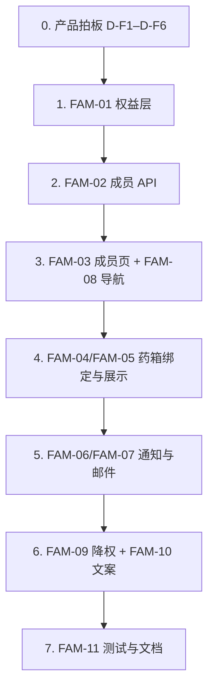

# Family Plan 完整落地 — 差距分析与补充范围

**文档编号**：FDA-NOTIF-SOW-FAMILY-GAP-001  
**版本**：1.0  
**日期**：2026-06-06  
**实施状态**：待开发  
**用途**：说明当前 Family Plan 与合同级「家庭成员药箱」的差距，作为开发补充范围与验收依据  

**基准需求**：[REQUIREMENTS-CLIENT.md](./REQUIREMENTS-CLIENT.md) v4.2 — **V2-4 家庭成员药箱**、**SUB-03 家庭计划**  
**相关文档**：[PLAN-ENTITLEMENTS-AND-SMS-CLEANUP.md](./PLAN-ENTITLEMENTS-AND-SMS-CLEANUP.md)、[QA-PLAN-ENTITLEMENTS.md](./QA-PLAN-ENTITLEMENTS.md)、[IMPLEMENTATION-COMPARISON.md](./IMPLEMENTATION-COMPARISON.md)

**备选方案**：[PLAN-FAMILY-INVITE-MODEL.md](./PLAN-FAMILY-INVITE-MODEL.md) — 邀请已有 SafeTrack 账户加入家庭组（独立数据模型，~52–58h）。**两套模型不可混用**，实施前须产品选定其一。

**总览与报价**：[PLAN-FAMILY-OVERVIEW.md](./PLAN-FAMILY-OVERVIEW.md) — 客户最新 Family Protection 卖点；**方案 A（本文）/ 方案 B / 附加 Caregiver** 分包说明。

---

## 一、现状评估（Gap Summary）

### 1.1 已实现（仅「大容量 Personal」层）

| 能力 | 实现位置 | 说明 |
|------|----------|------|
| Family 订阅计费 | `lib/stripe.ts`、`lib/stripe-billing.ts`、Stripe Webhook | 可订阅/升级至 Family，plan 写入 DB |
| 药品数量配额 | `lib/plan.ts` → `QUOTAS.family.meds = 50` | Family 最多 50 条 active 药 |
| 降权监控 | `lib/plan-monitoring.ts` | 降 plan 时按 `added_at` 暂停超额药品 |
| 数据库骨架 | `0013_app_schema.sql`、`0024_medication_items_member_id.sql` | `family_members` 表、`medication_items.member_id` 外键已存在 |
| 列表辅助函数 | `lib/cabinet-items.ts` | 可 join 成员名，**但未被页面/API 使用** |

### 1.2 未实现（Family Plan 核心差异）

| 原始需求 | 当前状态 |
|----------|----------|
| 多成员独立药箱 | ❌ 所有药品挂在同一账户下，`member_id` 从未写入 |
| 按成员切换/查看 | ❌ 无 `/family` 页面、无成员 CRUD API、无成员切换 UI |
| 按成员区分通知 | ❌ 通知/邮件仅到账户邮箱，不显示「属于哪位成员」 |
| 5 位家庭成员上限 | ❌ 无成员配额逻辑 |
| Family 导航与权限门控 | ❌ `AppShell` 无 Family 链接；`middleware` 保护了 `/family` 但页面不存在（404） |
| 与 Family 计划配套的卖点文案 | ⚠️ `PlanCards` 仍写「Priority alerts / Faster monitoring」等未实现能力 |

**结论**：当前 Family Plan ≈ **Personal Pro + 更高药品上限（20→50）+ 更高月费**；**不是** v4.2 定义的「家庭成员药箱」。

### 1.3 代码证据（关键缺口）

**配额层** — 仅有药品数，无成员管理（`lib/plan.ts`）：

```ts
export const QUOTAS: Record<Plan, Quota> = {
  free: { meds: 2 },
  personal: { meds: 20 },
  family: { meds: 50 },
};
```

**药箱 API** — POST 不接受 `member_id`（`app/api/cabinet/route.ts`）。

**药箱页面** — 查询不含 `member_id`，未使用 `listCabinetItems()`（`app/(app)/cabinet/page.tsx`）。

**导航** — 无 Family 入口（`components/AppShell.tsx`）。

> **文档与代码不一致**：`IMPLEMENTATION-COMPARISON.md` 将 V2-4 标为 ✅，但仓库中 **不存在** `app/(app)/family/`、`app/api/family/`、`FamilyMembersList` 等文件。实施本范围后应同步更新该文档。

---

## 二、目标行为定义

对照 v4.2 **V2-4**：「多成员独立药箱与通知；药品均手动添加；切换成员正确」。

| 维度 | 目标行为 |
|------|----------|
| 账户模型 | **一个登录账户**（家庭管理员）管理最多 **5 名家庭成员**（非独立账号） |
| 药箱归属 | 每条药品绑定 `member_id`；可按成员筛选或分组展示 |
| 通知 | 仍发送至**账户邮箱**；邮件/站内通知须标明 **For: [成员名]** |
| 配额 | Family：**50 药品 + 5 成员**；Personal：**20 药品、0 成员** |
| 降权 | 从 Family 降为 Personal/Free 时：禁止新增/编辑成员；已有 `member_id` 数据保留但成员 CRUD 冻结；监控配额仍走现有 `syncMonitoringQuota` |
| 不在范围 | 成员独立登录、成员独立邮箱/手机、成员级通知偏好（除非另开 change order） |

与 [PLAN-ENTITLEMENTS-AND-SMS-CLEANUP.md](./PLAN-ENTITLEMENTS-AND-SMS-CLEANUP.md) **D5 已确认**：采用方案 B — 导航 + 药箱成员名，**无** Dashboard 按成员汇总看板（可选二期）。

---

## 三、补充开发范围 — 模块明细

**总目标**：将 Family Plan 从「容量升级」升级为「家庭成员药箱 + 按成员可识别的通知」。

**预估总工时**：**18–22 人时**（原 V2-4 为 7h；因当前从零补 UI/API/通知链路，且需联调 SUB-03 降权，工时上浮）

| ID | 模块 | 功能说明 | 验收标准 | 工时 |
|----|------|----------|----------|------|
| **FAM-01** | 计划权益层 | 在 `lib/plan.ts` 增加 `familyMemberQuota()`、`canManageFamily(plan)`；Family 成员上限 **5** | 非 Family plan 调用成员 API 返回 403；Family 可管理成员 | 1 |
| **FAM-02** | 成员 CRUD API | 新建 `app/api/family/route.ts`：GET 列表、POST 添加、PATCH 编辑、DELETE 删除；`enforceFamilyQuota` | 第 6 个成员返回 402；RLS 仅本人可操作 | 3 |
| **FAM-03** | 成员管理页 | 新建 `app/(app)/family/page.tsx` + 列表/表单组件；Personal/Free 访问显示 **升级 CTA** | QA 清单 E2–E5 通过 | 3 |
| **FAM-04** | 加药绑定成员 | `MedicationForm` + `POST/PATCH /api/cabinet` 支持 `memberId`；Family 用户显示 **For: [成员]** 下拉 | 保存后 DB `member_id` 正确；非 Family 不显示该字段 | 2 |
| **FAM-05** | 药箱 UI 按成员展示 | `cabinet/page.tsx` 改用 `listCabinetItems()`；列表显示 **For: 成员名**；可选按成员 Tab/筛选 | QA 清单 E6 通过；Paused 区块同样显示成员 | 2 |
| **FAM-06** | 通知按成员可识别 | `notifications` 列表 join `medication_items.member_id` → 成员名；Dashboard 最近告警显示成员 | 用户可看出哪条药属于哪位成员 | 2 |
| **FAM-07** | 邮件/Digest 成员上下文 | `notification-dispatcher.ts`、`daily-digest.ts` 模板增加成员名行 | 即时邮件与 Digest 含成员名（有则显示） | 2 |
| **FAM-08** | 导航与门控 | `AppShell`：`plan === 'family'` 时显示 **Family** 链到 `/family` | Personal 无 Family 导航（QA D8/E2） | 1 |
| **FAM-09** | 降权与成员冻结 | `revokePaidAccess` / 降 plan 后：非 Family 禁止成员 CRUD | Family→Personal 后不能加成员；已有成员数据不丢 | 2 |
| **FAM-10** | 定价文案对齐 | `PlanCards`、`UpgradeModal`：Family bullets 改为「5 members、50 meds、Per-member cabinets」；移除未实现卖点 | 与 QA 清单 B4 一致 | 1 |
| **FAM-11** | 测试与文档 | `plan.test.ts`、family API 测试；更新 `IMPLEMENTATION-COMPARISON.md` | 单元测试 + 手工 UAT E1–E8 通过 | 2 |
| | **合计** | | | **21** |

---

## 四、需修改的现有文件

### 4.1 P0 — 数据与 API

| 文件 | 改动内容 |
|------|----------|
| `lib/plan.ts` | 增加成员配额、`canManageFamily`、`enforceFamilyQuota`、`FamilyQuotaExceededError` |
| `app/api/family/route.ts` | **新建** — 成员 CRUD |
| `app/api/cabinet/route.ts` | POST/PATCH 接受并校验 `memberId`（须属于当前用户且 plan=family） |
| `app/api/cabinet/[id]/route.ts`（若存在） | 同上 |

### 4.2 P1 — 前端 UX

| 文件 | 改动内容 |
|------|----------|
| `app/(app)/family/page.tsx` | **新建** — 成员管理 |
| `components/family/FamilyMembersList.tsx`（或同类） | **新建** |
| `components/cabinet/MedicationForm.tsx` | 成员选择器；Family 计划下加载成员列表 |
| `app/(app)/cabinet/page.tsx` | 使用 `listCabinetItems()`；展示 `member_display_name` |
| `components/AppShell.tsx` | 读取 `getEffectivePlan`，条件渲染 Family 导航 |
| `app/(app)/notifications/page.tsx` | 告警列表增加成员列/标签 |
| `app/(app)/dashboard/page.tsx` | 可选：Family 用户显示按成员汇总 active 药数 / 未读数（非 D5 必交付项） |

### 4.3 P2 — 通知链路

| 文件 | 改动内容 |
|------|----------|
| `lib/notification-dispatcher.ts` | select 增加 `member_id` + join `family_members`；邮件模板填充成员名 |
| `lib/daily-digest.ts` | Digest 每行增加成员名 |
| `emails/*.html` | 增加 `{{memberLine}}` 占位符（可选） |

### 4.4 P3 — 订阅生命周期

| 文件 | 改动内容 |
|------|----------|
| `lib/stripe-billing.ts` → `revokePaidAccess` | 降权时触发成员「只读/冻结」逻辑（不删数据） |
| `components/billing/PlanCards.tsx` | Family 卖点与 QA 清单对齐 |
| `components/billing/UpgradeModal.tsx` | Family 升级文案强调成员 + 50 药，而非仅容量 |

### 4.5 数据库

**无需新 migration**（建议）。现有 schema 已足够：

- `family_members(id, user_id, display_name, relationship)`
- `medication_items.member_id → family_members(id) ON DELETE CASCADE`

删除成员时，其名下药品会 cascade 删除 — 需在 UI 做 **确认提示**（见 §六 D-F3）。

---

## 五、验收清单

### 5.1 成员管理

- [ ] Family 用户可添加最多 **5** 名成员（display_name 必填，relationship 可选）
- [ ] 第 6 名成员返回 **402** + UpgradeModal（若已是最高 tier 则提示删成员）
- [ ] 可编辑成员 display_name / relationship
- [ ] 删除成员前确认；删除后其药品按产品决策 cascade 或改为 unassigned

### 5.2 药箱与成员绑定

- [ ] Family 用户加药时可选择 **For: 某成员**
- [ ] `/cabinet` 列表显示 **For: 成员名**
- [ ] Personal / Free 用户 **无** 成员选择器；访问 `/family` 仅见升级 CTA
- [ ] 总 active 药品仍受 **50** 上限约束（现有逻辑保留）

### 5.3 通知

- [ ] 站内 `/notifications` 可识别告警对应成员
- [ ] Instant 邮件 / Daily Digest 含成员名（当 `member_id` 非空）
- [ ] 通知仍走**账户级**偏好（email instant/digest、Class 过滤）；**不要求**成员独立偏好

### 5.4 导航与订阅

- [ ] Family 用户顶栏有 **Family** → `/family`
- [ ] Personal 用户顶栏 **无** Family 链接
- [ ] Stripe 订阅 Family $9.99/mo 或 $99.99/yr 后 plan 生效，上述功能解锁
- [ ] 降权至 Personal/Free 后：不能新增成员；药品监控配额按 [QA-PLAN-ENTITLEMENTS.md](./QA-PLAN-ENTITLEMENTS.md) F 段（paused）逻辑

### 5.5 回归

- [ ] Personal Pro 行为不变（20 药、无成员 UI）
- [ ] Free 行为不变（2 药）
- [ ] `npm run build` 通过；family API 有基本测试

---

## 六、产品决策点（开发前需确认）

| # | 问题 | 建议 |
|---|------|------|
| D-F1 | 加药时 `member_id` **必填还是可选**？ | 建议 Family 用户**必选**（否则「成员药箱」名不副实） |
| D-F2 | 未分配成员的药怎么处理？ | 建议不允许；或显示为「Household (unassigned)」 |
| D-F3 | 删除成员是否 cascade 删除其药品？ | DB 已 cascade；UI 需强确认文案 |
| D-F4 | Family→Personal 降权后已有成员数据？ | 建议**保留只读**（展示历史成员名），禁止 CRUD |
| D-F5 | Dashboard 是否做「按成员分组看板」？ | v4.2 最低验收为「切换成员正确」；分组看板可放二期（D5 已选方案 B） |
| D-F6 | 是否支持「默认成员」？ | 可选：`profiles` 增加 `default_member_id` 减少每次选择 |

---

## 七、明确不在本次补充范围内

- 家庭成员**独立账号**登录
- 成员独立邮箱 / SMS / 通知偏好
- Admin 后台查看家庭成员汇总（ADM-02 已取消）
- 化妆品 / 食品监控（PlanCards 当前误导文案，应删除而非开发）
- 「Priority alerts / Faster monitoring」等**虚假差异化**能力

---

## 八、工时汇总

| 类别 | 工时 | 说明 |
|------|------|------|
| 权益 + API | 4 | FAM-01、FAM-02 |
| 前端页面 | 7 | FAM-03、FAM-04、FAM-05、FAM-08 |
| 通知链路 | 4 | FAM-06、FAM-07 |
| 降权 + 文案 | 3 | FAM-09、FAM-10 |
| 测试文档 | 2 | FAM-11 |
| **合计** | **21** | 约 **2–3 个工作日**（单人全职） |

---

## 九、建议实施顺序



1. **第 1 天**：FAM-01、FAM-02、FAM-03、FAM-08（成员 CRUD + 页面 + 导航）  
2. **第 2 天**：FAM-04、FAM-05、FAM-06（药箱绑定 + 列表 + 通知展示）  
3. **第 3 天**：FAM-07、FAM-09、FAM-10、FAM-11（邮件、降权、文案、测试）

---

## 十、一句话总结

要真正落地 Family Plan，需在现有 **50 药配额 + Stripe 计费** 之上，补齐 **成员 CRUD（5 人上限）→ 加药绑定 member_id → 药箱/通知/邮件按成员展示 → 导航与降权门控 → 定价文案诚实化** 整条链路。数据库已就绪，主要工作是 API + 页面 + 通知模板，约 **21 人时**。

---

## 修订记录

| 版本 | 日期 | 说明 |
|------|------|------|
| 1.0 | 2026-06-06 | 初版：差距分析、模块明细、验收清单与工时估算 |

---

## 相关文档

- [PLAN-FAMILY-OVERVIEW.md](./PLAN-FAMILY-OVERVIEW.md) — **总览**：客户卖点、A/B/C 分包报价
- [PLAN-FAMILY-INVITE-MODEL.md](./PLAN-FAMILY-INVITE-MODEL.md) — **备选**：邀请已有账户方案
- [REQUIREMENTS-CLIENT.md](./REQUIREMENTS-CLIENT.md) — 客户合同范围（V2-4、SUB-03）
- [PLAN-ENTITLEMENTS-AND-SMS-CLEANUP.md](./PLAN-ENTITLEMENTS-AND-SMS-CLEANUP.md) — 订阅权益与 D5 决策
- [QA-PLAN-ENTITLEMENTS.md](./QA-PLAN-ENTITLEMENTS.md) — 手工 UAT（E 段 Family Protection）
- [IMPLEMENTATION-COMPARISON.md](./IMPLEMENTATION-COMPARISON.md) — 实现对照（V2-4 待更正）
