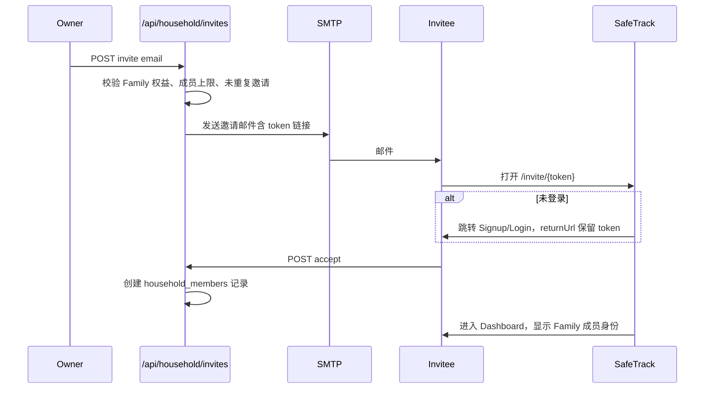

# Family Plan — 邀请已有账户方案（替代模型）

**文档编号**：FDA-NOTIF-SOW-FAMILY-INVITE-001  
**版本**：1.0  
**日期**：2026-06-06  
**实施状态**：待产品确认 / 待开发  
**用途**：Family Plan 的**备选产品模型** — 通过邮箱邀请**已有或新注册**的 SafeTrack 账户加入同一家庭组  

**与 Profile 方案关系**：本文档为 [PLAN-FAMILY-IMPLEMENTATION.md](./PLAN-FAMILY-IMPLEMENTATION.md)（**方案 A**：管理员 + 成员档案、无需成员登录）的**替代方案（方案 B）**。两套模型**不可混用**同一套 `family_members` 表语义，实施前须产品书面选定其一。

**总览与报价**：[PLAN-FAMILY-OVERVIEW.md](./PLAN-FAMILY-OVERVIEW.md) — 客户卖点映射；Shared family dashboard 归属 **方案 B**；Caregiver notifications 为 **附加方案 C**。

**相关文档**：[REQUIREMENTS-CLIENT.md](./REQUIREMENTS-CLIENT.md)、[PLAN-ENTITLEMENTS-AND-SMS-CLEANUP.md](./PLAN-ENTITLEMENTS-AND-SMS-CLEANUP.md)、[QA-PLAN-ENTITLEMENTS.md](./QA-PLAN-ENTITLEMENTS.md)

---

## 〇、两种 Family 模型对比

| 维度 | Profile 方案（FAM-001） | **邀请账户方案（本文档）** |
|------|-------------------------|---------------------------|
| 成员是否需要 SafeTrack 账号 | ❌ 不需要 | ✅ **需要**（邀请时无账号则引导注册） |
| 添加成员方式 | 管理员填写 display_name | **邮箱邀请** → 对方接受 |
| 药箱归属 | 同一 `user_id` + `member_id` 标签 | **各成员自己的 `user_id`**，独立药箱 |
| 通知收件 | 全部发到管理员邮箱 | **各成员自己的邮箱** + 站内通知 |
| 通知偏好 | 账户级（管理员一套） | **成员各自** `notification_preferences` |
| 登录体验 | 仅管理员登录 | **每位成员各自登录**管理自己的药 |
| 数据模型改动 | 小（复用现有表） | **大**（家庭组、邀请、权益继承） |
| 预估工时 | ~21h | **~52–58h** |

---

## 一、产品模型概述

### 1.1 核心概念

| 概念 | 说明 |
|------|------|
| **Household（家庭组）** | 由一名 **Owner（家庭管理员）** 创建；绑定 **Family Protection** 订阅 |
| **Household Member（家庭成员）** | 已接受邀请的 **真实 SafeTrack 账户**（`auth.users`） |
| **Invite（邀请）** | Owner 输入邮箱发出邀请；受邀人通过链接 **接受 / 拒绝** |
| **Effective Plan（有效计划）** | 成员加入活跃家庭组后，继承家庭的 **Family** 权益（50 药、即时邮件等），**无需单独付费** |

### 1.2 用户故事（简要）

1. Alice 订阅 Family Protection，成为 Household Owner。  
2. Alice 在 **Family** 页输入 `bob@example.com` 发送邀请。  
3. Bob 已是 SafeTrack 用户 → 收到邮件，登录后点击 **Accept**，加入 Alice 的家庭组。  
4. Bob 若尚未注册 → 邀请链接跳转 **Signup**，注册完成后自动关联待处理邀请。  
5. Bob 登录后管理 **自己的药箱**；召回通知发到 **Bob 的邮箱** 与站内通知。  
6. Alice（Owner）可在家庭页看到成员列表、各成员 active 药数量；**可选**查看汇总（不含编辑 Bob 的药，除非另定监护人权限）。  
7. 家庭组 **active 药品总数** 不超过 50；**成员数**（含 Owner）不超过 5。  
8. Alice 降权或订阅结束 → 全组失去 Family 权益；各成员回退到个人 Free / 原有 Personal 订阅（见 §六）。

### 1.3 与 v4.2 V2-4 的对应关系

原需求「多成员独立药箱与通知；切换成员正确」在本模型下解读为：

- **独立药箱**：每位成员 **独立账户、独立 `medication_items`**  
- **独立通知**：每位成员 **独立通知通道与偏好**  
- **切换成员**：Owner 在家庭页 **切换查看** 各成员摘要（非替成员登录）；成员本人登录即看到自己的药箱  

> 本模型 **超出** 原合同 V2-4 字面范围（原设计为单账户多 Profile），实施须 **change order** 或客户书面确认。

---

## 二、目标行为定义

### 2.1 角色与权限

| 角色 | 人数 | 权限 |
|------|------|------|
| **Owner** | 1 名/家庭组 | 管理订阅、发邀请、撤销邀请、移除成员、转让 Owner（可选）、查看家庭汇总 |
| **Member** | 最多 4 名（+ Owner = 5） | 管理**自己的**药箱与通知偏好；可主动 **Leave household** |
| **非成员** | — | 无家庭组能力；Personal / Free 照常 |

**默认建议（D-I 系列）**：Member **不能**编辑他人药箱；Owner **不能**代他人加药（避免 HIPAA/隐私争议）。若需「家长代管子女」，列为二期 **Guardian** 角色。

### 2.2 邀请流程



| 规则 | 说明 |
|------|------|
| 邀请对象 | **邮箱**；不要求事先已是用户，但 **接受时必须拥有账户** |
| 重复邀请 | 同一 household + email 仅一条 `pending`；可重发延长 expiry |
| 已在其他家庭组 | **拒绝**加入（一人仅属一个家庭组，D-I1） |
| 邀请自己 | 拒绝 |
| Owner 已是第 5 人 | 含 pending 邀请总数 ≤ 4 个待接受 + 当前成员 ≤ 5（D-I2 可调整） |
| 邀请过期 | 默认 **7 天**；过期后状态 `expired`，Owner 可重新邀请 |

### 2.3 配额与权益

| 配额项 | Family Household | Personal（ solo） | Free（solo） |
|--------|------------------|-------------------|--------------|
| 家庭成员（含 Owner） | ≤ 5 | — | — |
| 家庭 **合计** active 药品 | ≤ 50 | — | — |
| 单人 active 药品（不在家庭组） | — | ≤ 20 | ≤ 2 |
| 即时邮件 / Digest | 成员各自按 [PLAN-ENTITLEMENTS](./PLAN-ENTITLEMENTS-AND-SMS-CLEANUP.md) Personal+ 规则 | 同左 | Free 规则 |

**有效计划解析（`getEffectivePlan` 重写）**：

```ts
// 伪代码
async function getEffectivePlan(userId): Promise<Plan> {
  const membership = await getActiveHouseholdMembership(userId);
  if (membership?.householdHasActiveFamilySubscription) return "family";
  return getSoloPlanFromStripeOrProfile(userId); // 现有逻辑
}
```

**加药配额**：`enforceMedQuota` 需同时检查：

1. 该用户所在家庭组 **合计** active 药是否 < 50；  
2. （可选）该用户个人是否另有 solo 上限 — 在 family 组内通常 **仅检查家庭合计**。

### 2.4 通知

| 场景 | 行为 |
|------|------|
| Bob 的药匹配召回 | 通知写入 `notifications.user_id = bob`；邮件发 **bob@** |
| Alice 查看家庭页 | 可见「Bob · 2 active · 1 unread」汇总；**不**强制推送 Alice 邮箱（D-I3 可选：Owner 抄送 Class I） |
| 偏好设置 | **各成员独立** `/settings/notifications` |

### 2.5 降权与离开

| 事件 | 行为 |
|------|------|
| Owner 取消 Family / 支付失败 | Household 标记 `subscription_inactive`；全员 `getEffectivePlan` 回退 solo plan；家庭合计 50 药 → 按 [plan-monitoring](./PLAN-ENTITLEMENTS-AND-SMS-CLEANUP.md) 对 **每人** 或 **每人+合计** 执行 paused（D-I4） |
| Member 主动 Leave | 移出 `household_members`；该用户药箱保留；配额按 solo plan 重算 |
| Owner 移除 Member | 同 Leave；被移除用户收到邮件通知 |
| Owner 降 Personal | 须先 **解散家庭组** 或 **移除所有成员**（D-I5） |

---

## 三、数据模型（新建 / 迁移）

> 现有 `family_members`（display_name 档案）与 `medication_items.member_id` **不适用于**本方案，建议 **废弃或迁移后停用**，避免两套语义并存。

### 3.1 新表

```sql
-- 家庭组
create table households (
  id bigint generated always as identity primary key,
  owner_user_id uuid not null references auth.users(id),
  name text,  -- 可选，如 "Weng Family"
  created_at timestamptz default now()
);

-- 成员关系（含 Owner）
create table household_members (
  household_id bigint not null references households(id) on delete cascade,
  user_id uuid not null references auth.users(id) on delete cascade,
  role text not null check (role in ('owner', 'member')),
  joined_at timestamptz default now(),
  primary key (household_id, user_id),
  unique (user_id)  -- 一人仅一个家庭组
);

-- 邀请
create table household_invites (
  id bigint generated always as identity primary key,
  household_id bigint not null references households(id) on delete cascade,
  invitee_email text not null,
  invited_by uuid not null references auth.users(id),
  token text not null unique,
  status text not null default 'pending'
    check (status in ('pending', 'accepted', 'declined', 'expired', 'revoked')),
  expires_at timestamptz not null,
  created_at timestamptz default now()
);
create index idx_household_invites_email_pending
  on household_invites(household_id, invitee_email) where status = 'pending';
```

### 3.2 现有表调整

| 表 | 调整 |
|----|------|
| `stripe_subscriptions` / `profiles.plan` | 订阅仍挂在 **Owner**；或增加 `households.stripe_subscription_id` |
| `medication_items` | **不再使用** `member_id`；药品始终 `user_id = 当前登录用户` |
| `family_members` | 标记 deprecated；新功能不读写 |
| RLS | `household_members`：成员可读同组 id；Owner 可写邀请/移除；**药箱 RLS 保持仅本人** |

### 3.3 Migration 策略

1. 新增 `households` / `household_members` / `household_invites`；  
2. Family 订阅 Owner 首次访问 `/family` 时 **懒创建** household；  
3. 若曾用 Profile 方案写入 `family_members`，需一次性迁移脚本（通常无生产数据可跳过）。

---

## 四、补充开发范围 — 模块明细

**预估总工时**：**52–58 人时**（约 **1.5–2 周** 单人全职）

| ID | 模块 | 功能说明 | 验收标准 | 工时 |
|----|------|----------|----------|------|
| **FINV-01** | 数据模型与 RLS | migrations §3；RLS 策略；废弃 `member_id` 路径 | migration 可回滚；RLS 测试通过 | 6 |
| **FINV-02** | 有效计划解析 | 重写 `getEffectivePlan`：household 订阅 → 全员 Family | 成员无 Stripe 订阅仍享 Family 配额 | 4 |
| **FINV-03** | 家庭合计配额 | `enforceHouseholdMedQuota`：全组 active ≤ 50；个人加药前检查 | 第 51 条（跨成员合计）返回 402 | 4 |
| **FINV-04** | Household 生命周期 | Owner 订阅 Family 时创建/绑定 household；降权时解散或冻结 | Webhook 与 `revokePaidAccess` 联动 | 4 |
| **FINV-05** | 邀请 API | `POST/GET/DELETE /api/household/invites`；token 生成；重发；撤销 | pending 上限；重复邮箱处理正确 | 6 |
| **FINV-06** | 接受/拒绝邀请 | `GET /invite/[token]` 页；`POST accept/decline`；未登录引导 signup | 7 天过期；已在其他组拒绝 | 5 |
| **FINV-07** | 邀请邮件 | 模板 + SMTP；含 accept 链接与 household 名称 | 测试 inbox 收到 | 2 |
| **FINV-08** | 成员管理 API | `GET /api/household`；Owner 移除成员；Member leave | 不能移除 Owner；Owner 转让（可选 +3h） | 4 |
| **FINV-09** | Family 管理页 | `/family`：成员列表、pending 邀请、邀请表单、Leave 按钮 | Personal 用户见升级 CTA | 5 |
| **FINV-10** | 家庭汇总 UI | Owner 查看各成员 active 数 / unread（只读） | 不暴露他人药箱详情（默认） | 3 |
| **FINV-11** | 药箱与配额 UX | 加药时若家庭合计将超限，402 文案区分 solo vs household | UpgradeModal / 联系 Owner 提示 | 2 |
| **FINV-12** | 通知与降权 | 降权时全员 `syncMonitoringQuota`；Leave 时 solo 重算 | F 段 QA 对 invite 模型仍成立 | 4 |
| **FINV-13** | 导航与身份展示 | AppShell 显示家庭名 / 角色；Member 看到「Family of {Owner}」 | 非成员无 Family 入口 | 2 |
| **FINV-14** | 定价与文案 | PlanCards：强调「Invite up to 4 others」；移除 Profile 型描述 | 与产品一致 | 1 |
| **FINV-15** | 测试与 QA 文档 | 单元 + 集成测试；`QA-PLAN-FAMILY-INVITE.md` | E2E 邀请流通过 | 6 |
| | **合计** | | | **58** |

*若不做 Owner 转让（FINV-08 可选）≈ **55h**。*

---

## 五、需修改的现有模块

| 模块 | 改动要点 |
|------|----------|
| `lib/plan.ts` | `getEffectivePlan` 委托 household；`enforceMedQuota` → household 合计 |
| `lib/stripe-billing.ts` | Checkout 成功创建/绑定 household；revoke 时解散或冻结成员 |
| `lib/plan-monitoring.ts` | 降权时对 household 内 **每个 user_id** 执行 paused 逻辑 |
| `lib/matching.ts` / dispatcher | 无大改（仍 per `user_id`）；移除任何 `member_id` 假设 |
| `app/api/cabinet/route.ts` | 加药前 `enforceHouseholdMedQuota` |
| `components/billing/*` | Family 文案改为邀请制 |
| `middleware.ts` | `/invite/*` 公开或半公开路由 |
| `emails/` | 新增 `household-invite.html`、`household-removed.html` |

**不再实施**（Profile 方案专属）：`member_id` 加药下拉、`family_members` CRUD、通知模板 `For: display_name`。

---

## 六、产品决策点（实施前必确认）

| # | 问题 | 建议 |
|---|------|------|
| D-I1 | 一人能否同时属于多个家庭组？ | **否**（`household_members.user_id` unique） |
| D-I2 | pending 邀请是否占用 5 人名额？ | **是**，防滥用 |
| D-I3 | Owner 是否接收成员召回邮件抄送？ | **否**（默认）；Class I 抄送可选二期 |
| D-I4 | 降权时 50→2 药，paused 范围？ | **按家庭合计**保留最早 2 条 active（跨成员）；或 **每人**保留 2 条 — 须二选一 |
| D-I5 | Owner 降 Personal 前是否强制解散？ | **是** |
| D-I6 | 成员已有 Personal 订阅时加入家庭？ | Stripe **暂停**成员个人订阅或提示手动取消（复杂，建议 MVP：**允许重叠，Family 权益优先，不自动取消 Personal**） |
| D-I7 | 儿童无邮箱 | 本模型 **不支持**；须用 Profile 方案或 Guardian 二期 |
| D-I8 | 邀请未注册用户 | Signup 完成后 **自动 accept** 同一 token |

---

## 七、验收清单

### 7.1 邀请

- [ ] Owner（Family）可输入邮箱发送邀请  
- [ ] 受邀已注册用户登录后可 Accept / Decline  
- [ ] 受邀未注册用户 Signup 后自动加入  
- [ ] 重复 pending 邀请、邀请自己、已满 5 人、对方已在其他组 → 明确错误  
- [ ] 邀请 7 天过期；Owner 可 revoke pending  

### 7.2 成员与药箱

- [ ] 成员登录仅见 **自己的** 药箱  
- [ ] 家庭 **合计** active 药 ≤ 50；第 51 条拒绝  
- [ ] 成员各自 `/settings/notifications` 独立生效  
- [ ] 成员 recall 邮件发到 **本人邮箱**  

### 7.3 Owner 视图

- [ ] `/family` 列出 active 成员 + pending 邀请  
- [ ] Owner 可移除成员；成员可 Leave  
- [ ] Owner 可见各成员 active / unread **计数**（默认不见明细）  

### 7.4 订阅与降权

- [ ] 仅 Owner 账户绑定 Stripe Family 订阅  
- [ ] 成员无需付费即享 Family 权益  
- [ ] 订阅结束 / 支付失败 → 全员失去 Family 权益；监控 paused 符合 D-I4  
- [ ] Personal / Free solo 用户行为回归不变  

---

## 八、风险与范围外

| 风险 | 说明 |
|------|------|
| 合同范围 | 原 V2-4 为单账户 Profile 模型；本方案为 **change order** 级增量 |
| Stripe 复杂度 | 成员自带 Personal 订阅时的计费冲突（D-I6） |
| 隐私合规 | 多账户模型需隐私政策更新（各成员数据控制者表述） |
| 设计稿偏差 | `stitch_*` 中「成员独立偏好」与本模型一致；「designated managers」需明确是否等于 Owner 只读汇总 |

**明确不做（除非另立项）**：

- Owner 代成员编辑药箱（Guardian）  
- 儿童无邮箱账户  
- 跨家庭组 / 组织级 Admin  
- SMS 按成员发送  

---

## 九、工时汇总

| 类别 | 工时 |
|------|------|
| 数据模型 + RLS | 6 |
| 权益 / 配额 / Stripe | 12 |
| 邀请 API + 邮件 + 落地页 | 13 |
| 前端 Family 页 + 导航 | 10 |
| 降权 + 回归 | 6 |
| 测试 + 文档 | 6 |
| **可选** Owner 转让 | +3 |
| **合计** | **52–58** |

---

## 十、建议实施顺序

1. **Phase A**（FINV-01–04）：schema + `getEffectivePlan` + household 绑定 Stripe  
2. **Phase B**（FINV-05–07）：邀请 API + 邮件 + `/invite/[token]`  
3. **Phase C**（FINV-08–10）：Family 管理页 + 汇总  
4. **Phase D**（FINV-11–14）：配额 UX、降权、文案  
5. **Phase E**（FINV-15）：测试与 QA 文档  

---

## 十一、方案选择建议

| 选择 Profile 方案（21h）若… | 选择 Invite 方案（58h）若… |
|-----------------------------|----------------------------|
| 主要给配偶/父母 **代管** 药品 | 每位家人 **自己** 管药、自己收通知 |
| 成员无邮箱或不愿注册 | 成员愿意注册/已有账户 |
| 尽快对齐 v4.2 字面需求 | 产品定位更接近「家庭协作 SaaS」 |
| 控制 scope 与预算 | 客户接受 change order 与更长工期 |

---

## 修订记录

| 版本 | 日期 | 说明 |
|------|------|------|
| 1.0 | 2026-06-06 | 初版：邀请已有账户模型、数据设计、模块与验收 |

---

## 相关文档

- [PLAN-FAMILY-OVERVIEW.md](./PLAN-FAMILY-OVERVIEW.md) — **总览**：客户卖点、A/B/C 分包报价  
- [PLAN-FAMILY-IMPLEMENTATION.md](./PLAN-FAMILY-IMPLEMENTATION.md) — **方案 A**（Profile，无需成员账号）  
- [PLAN-ENTITLEMENTS-AND-SMS-CLEANUP.md](./PLAN-ENTITLEMENTS-AND-SMS-CLEANUP.md) — 订阅权益基线  
- [QA-PLAN-ENTITLEMENTS.md](./QA-PLAN-ENTITLEMENTS.md) — 现有 UAT（实施本方案后需另写 INVITE 版 QA）
