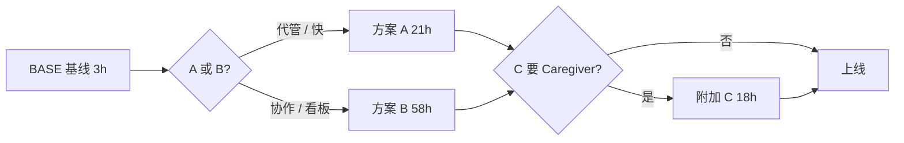

# Family Protection — 总览方案书（客户需求同步版）

**文档编号**：FDA-NOTIF-SOW-FAMILY-MASTER-001  
**版本**：1.1  
**日期**：2026-06-06  
**实施状态**：待客户选型 / 范围确认  
**用途**：同步客户最新 Family Protection 卖点，将功能拆为 **方案 A（Profile）**、**方案 B（邀请账户 + 共享看板）**、**附加方案 C（Caregiver notifications）** 分别估工时  

**子文档（技术明细）**：

- [PLAN-FAMILY-IMPLEMENTATION.md](./PLAN-FAMILY-IMPLEMENTATION.md) — **方案 A** 完整模块与验收  
- [PLAN-FAMILY-INVITE-MODEL.md](./PLAN-FAMILY-INVITE-MODEL.md) — **方案 B** 完整模块与验收  

---

## 一、结构建议（团队结论）

将 Family 拆成 **A / B 二选一 + C 可选附加**，是合理且推荐的做法：

| 优点 | 说明 |
|------|------|
| **与客户卖点一一对应** | 共享看板 → B；Caregiver → C；5 成员 + 100 药 → 基线（A 或 B 均含） |
| **控制预算与工期** | 客户可先上 **A + C**（代管老人 + 照顾者邮件），再升级 B |
| **避免重复开发** | A 与 B **成员模型互斥**，不会两套同时维护 |
| **Caregiver 可复用** | C 在 A、B 上各有一层集成，但 **通知扇出逻辑共用**，单独估工时清晰 |

**推荐组合**（按产品故事）：

| 客户目标 | 建议组合 |
|----------|----------|
| 尽快上线「帮父母管药」、成员不一定有账号 | **基线 + 方案 A + 方案 C** |
| 全家各自登录、要看共享家庭看板 | **基线 + 方案 B**（C 强烈建议叠加） |
| 合同原 V2-4 最小对齐 | **基线 + 方案 A**（不含 C、不含 B） |

---

## 二、客户最新需求同步（2026-06）

### 2.1 定价页 — Family Protection

| 项目 | 客户确认内容 |
|------|----------------|
| 月付 | **$9.99/mo** |
| 年付 | **$99.99/yr** |
| 定位 | Personal Pro = 保护自己；Family Protection = **保护全家，尤其老人和孩子** |

### 2.2 功能卖点与客户解释映射

| 定价页 Bullet | 含义（客户说明） | 方案归属 |
|---------------|------------------|----------|
| Everything in Personal Pro | 即时邮件、Digest、20→100 药上限、批号等 Personal+ 能力 | **基线 BASE**（A/B 均含） |
| Track up to **5 family members** | 家庭内最多 5 人（含管理员/Owner 或 5 个 Profile） | **A 或 B** |
| Track up to **100 medications** | 家庭合计或账户合计 active 监控上限 **100**（非现网 50） | **基线 BASE** |
| **Shared family dashboard** | 家庭管理员可查看各成员药箱/告警**汇总视图**（只读汇总） | **方案 B** |
| **Caregiver notifications** | 召回发生时除**患者本人**外，**照顾者**（配偶/子女等）也收到邮件/站内通知 | **附加方案 C** |
| **Priority family alerts** | 营销表述；**无单独技术 SLA** 时建议实现为：Family + Caregiver 均走 Instant 通道，邮件模板标注 Family / Caregiver 身份 | **基线文案 + C**（见 §4.4） |

### 2.3 Caregiver notifications — 客户原意摘要

> 不是只通知「吃药的人本人」，也要通知「照顾他的人」。

**典型场景**：

- 妈妈服用某高血压药，已被纳入 Family Protection。  
- FDA 发布相关 recall 后，系统发邮件给：**妈妈本人** + **配偶 / 子女 / 其他 caregiver**。  

**产品价值**：老人不常看邮件、英文弱；**真正负责买药、联系医生的是子女或配偶** — 「家人的药被召回，照顾者第一时间知道。」

---

## 三、当前代码与基线差距

| 项目 | 现网 | 客户要求 |
|------|------|----------|
| Family 药品上限 | 50（`lib/plan.ts`） | **100** |
| 家庭成员 | 未实现 | **≤ 5** |
| 家庭模型 | 仅 plan 字符串 + Stripe | **A 或 B 整套** |
| Shared dashboard | 无 | **B** |
| Caregiver 扇出通知 | 无 | **C** |
| PlanCards 文案 | 部分未实现能力 | 与 §2.2 对齐 |

---

## 四、交付包定义与工时

> **规则**：**BASE** 为任意 Family 能力之前提；**A 与 B 互斥**；**C** 依赖已选 A 或 B（不可单独购买）。

### 4.1 基线 — BASE（Family 配额与卖点对齐）

**范围**：

- `QUOTAS.family.meds`: 50 → **100**  
- `PlanCards` / `UpgradeModal` / `pricing` 与 §2.2 一致（**不含** Shared dashboard、Caregiver 实现细节）  
- 「Priority family alerts」→ 统一为 **Instant 邮件** + 模板 Family 标识（无额外队列/SLA）  
- Stripe Family 价格不变（$9.99 / $99.99）  

| 模块 ID | 说明 | 工时 |
|---------|------|------|
| BASE-01 | `lib/plan.ts`、配额测试、402 文案（100 药） | 1 |
| BASE-02 | `plan-monitoring` / 降权 paused 适配 100 | 1 |
| BASE-03 | 定价页与 Family bullets 诚实化（不含 B/C 未购能力） | 1 |
| **小计** | | **3h** |

---

### 4.2 方案 A — Profile 家庭档案（单账户代管）

**模型**：一名登录用户创建最多 **5 个成员档案**（display_name），药品绑定 `member_id`；**成员无需 SafeTrack 账号**；通知默认发往**管理员邮箱**（带 For: 成员名）。

**覆盖客户卖点**：5 members、100 meds、Everything in Personal Pro。  
**不覆盖**：Shared family dashboard、成员各自登录、Caregiver 扇出（除非加 **C**）。

**技术明细** → [PLAN-FAMILY-IMPLEMENTATION.md](./PLAN-FAMILY-IMPLEMENTATION.md)

| 调整（相对 v1.0 子文档） | 说明 |
|--------------------------|------|
| 配额 50 → 100 | 已含于 BASE；A 内 FAM 模块验收改为 100 |
| 工时 | 子文档 **21h**；与 BASE 部分重叠 0h（BASE 单独计） |

| 包 | 工时 |
|----|------|
| **方案 A** | **21h** |
| **BASE + A** | **24h** |

**适合客户**：以**一名子女/配偶代管**父母与孩子药品；成员无邮箱或不愿注册。

#### 方案 A — 产品决策点（开发前需确认）

| # | 问题 | 建议 |
|---|------|------|
| D-F1 | 加药时 `member_id` **必填还是可选**？ | 建议 Family 用户**必选**（否则「成员药箱」名不副实） |
| D-F2 | 未分配成员的药怎么处理？ | 建议不允许；或显示为「Household (unassigned)」 |
| D-F3 | 删除成员是否 cascade 删除其药品？ | DB 已 cascade；UI 需强确认文案 |
| D-F4 | Family→Personal 降权后已有成员数据？ | 建议**保留只读**（展示历史成员名），禁止 CRUD |
| D-F5 | Dashboard 是否做「按成员分组看板」？ | v4.2 最低验收为「切换成员正确」；分组看板归 **方案 B**（Shared dashboard） |
| D-F6 | 是否支持「默认成员」？ | 可选：`profiles` 增加 `default_member_id` 减少每次选择 |
| D-F7 | 100 药为 **单账户合计**（含全部 Profile 名下 active 药）？ | 建议 **是**（与 BASE 一致） |

---

### 4.3 方案 B — 邀请账户 + Shared Family Dashboard

**模型**：Household + 邮箱邀请；成员为**真实账户**；各自药箱与通知偏好；Owner 在 **Shared family dashboard** 查看全员 active 药数、未读告警、成员状态（只读汇总，默认不看他人药箱明细）。

**覆盖客户卖点**：5 members、100 meds、Shared family dashboard、成员各自清单（客户描述「父母、配偶、孩子在 SafeTrack 里有自己的药品清单」）。

**技术明细** → [PLAN-FAMILY-INVITE-MODEL.md](./PLAN-FAMILY-INVITE-MODEL.md)

| 调整（相对 v1.0 子文档） | 说明 |
|--------------------------|------|
| 配额 50 → 100 | 已含于 BASE；FINV-03 验收改为 100 |
| FINV-10 | 即 **Shared family dashboard**（子文档已含） |
| 与 A 关系 | **不可与 A 同时实施**；若先做 A 再迁 B，另计迁移 **+8–12h** |

| 包 | 工时 |
|----|------|
| **方案 B** | **58h** |
| **BASE + B** | **61h** |

**适合客户**：强调**全家各自登录**、**共享看板**、与 stitch 设计稿「household partitioned」叙事一致。

#### 方案 B — 产品决策点（实施前必确认）

| # | 问题 | 建议 |
|---|------|------|
| D-I1 | 一人能否同时属于多个家庭组？ | **否**（`household_members.user_id` unique） |
| D-I2 | pending 邀请是否占用 5 人名额？ | **是**，防滥用 |
| D-I3 | Owner 是否接收成员召回邮件抄送？ | **否**（默认）；Class I 抄送可选二期，或与 **方案 C** 合并设计 |
| D-I4 | 降权时 100→2 药，paused 范围？ | **按家庭合计**保留最早 2 条 active（跨成员）；或 **每人**保留 2 条 — 须二选一 |
| D-I5 | Owner 降 Personal 前是否强制解散家庭组？ | **是** |
| D-I6 | 成员已有 Personal 订阅时加入家庭？ | 建议 MVP：**允许重叠，Family 权益优先，不自动取消 Personal** |
| D-I7 | 儿童无邮箱 | 本模型 **不支持**；须用 **方案 A** 或 Guardian 二期 |
| D-I8 | 邀请未注册用户 | Signup 完成后 **自动 accept** 同一 token |
| D-I9 | Shared dashboard 默认可见粒度？ | 建议：成员名 + active 药数 + unread 数；**不看**他人药箱明细与 NDC |
| D-I10 | 100 药为 **家庭组合计**（跨成员 active 总和）？ | 建议 **是**（与 BASE 一致） |

---

### 4.4 附加方案 C — Caregiver Notifications

**模型**：为每位**患者成员**（A：Profile；B：household 内 user）配置一名或多名 **Caregiver**；当该成员任一 active 药品命中 recall 时，除原有患者通知路径外，**向 Caregiver 发送副本**（邮件 + 可选站内，若 Caregiver 有账户）。

#### 4.4.1 行为定义

| 项 | 说明 |
|----|------|
| 触发 | 与现有 `notification-dispatcher` / digest 相同匹配事件 |
| 患者通道 | 不变（A：管理员邮箱+成员名；B：成员本人邮箱） |
| Caregiver 通道 | **额外** Instant 邮件（+ 可选 Digest 摘要行）；模板标明 `Caregiver alert for [Patient name]` |
| Caregiver 是谁 | **方案 A**：每名 Profile 可绑 1–3 个**邮箱**（无需账号）+ 可选「本账户 Owner 即为 Caregiver」默认勾选 |
| | **方案 B**：每名成员可指定 household 内**其他成员**为 Caregiver + 可选**外部邮箱** |
| 偏好 | Caregiver **不**单独 Class 过滤（沿用患者匹配结果）；若患者通知被 Class 过滤掉，Caregiver **也不发** |
| opt-in | 外部邮箱须通过确认链接激活（防滥用） |

#### 4.4.2 模块明细

| ID | 模块 | 说明 | 工时 |
|----|------|------|------|
| CARE-01 | 数据模型 | `caregiver_links`（patient_member_id 或 user_id, caregiver_email / caregiver_user_id, verified_at） | 3 |
| CARE-02 | 管理 UI | Family 页 / 成员编辑：添加、删除 Caregiver；A/B 两套表单 | 4 |
| CARE-03 | API + 校验 | CRUD；Family 计划门控；邮箱确认 token | 3 |
| CARE-04 | 通知扇出 | dispatcher + digest fan-out；去重；日志 | 4 |
| CARE-05 | 邮件模板 | `caregiver-recall-alert.html`；英文明示 patient 与 drug | 2 |
| CARE-06 | 测试 + QA | 单元 + `QA-PLAN-CAREGIVER.md` 片段 | 2 |
| **小计** | | | **18h** |

| 包 | 工时 |
|----|------|
| **附加 C**（在 A 或 B 之上） | **18h** |

**与 B 的部分重叠说明**：B 中成员本人已收通知；C 解决的是 **「非患者本人但需知晓」** 的额外收件人（如子女账户、外部邮箱）。客户案例「妈妈 + 子女 caregiver」在 **B+C** 下最完整；**A+C** 下妈妈可为 Profile、子女邮箱为 Caregiver，**无需子女注册**。

#### 方案 C — 产品决策点（开发前需确认）

| # | 问题 | 建议 |
|---|------|------|
| D-C1 | 每名患者最多绑定几名 Caregiver？ | 建议 **3**（含外部邮箱 +  household 内成员） |
| D-C2 | 外部 Caregiver 邮箱是否必须点确认链接？ | **是**（opt-in，防滥用与误发） |
| D-C3 | Caregiver 是否单独设置 Class 过滤？ | **否**；与患者同一匹配结果，患者被过滤则 Caregiver 不发 |
| D-C4 | Caregiver 是否接收 Daily Digest？ | 建议 **可选**（默认仅 Instant 扇出；Digest 含「您照顾的 [Name]」摘要行可选） |
| D-C5 | 方案 A：Owner 是否默认为所有 Profile 的 Caregiver？ | 建议 **默认勾选**，可取消 |
| D-C6 | 方案 B：household 内 Caregiver 是否要有独立站内通知？ | 建议 **是**（若 Caregiver 为已登录成员） |
| D-C7 | 「Priority family alerts」是否等于 Caregiver Instant？ | 建议 **是**；无单独更快队列，仅模板与扇出区分 |

---

## 五、组合工时表

| 组合 | 包含 | 工时 |
|------|------|------|
| **BASE** | 100 药 + 文案 | 3h |
| **BASE + A** | Profile 家庭 | 24h |
| **BASE + B** | 邀请 + 共享看板 | 61h |
| **BASE + A + C** | 代管 + Caregiver | 42h |
| **BASE + B + C** | 全家账户 + 看板 + Caregiver | 79h |
| A → B 迁移（若已上 A） | 数据迁移 + 停用 Profile 路径 | +8–12h |

*不含：Stripe 手续费、SMTP 用量、客户法务文案、Admin 后台。*

---

## 六、客户卖点 — 实现对照（签 off 用）

| 定价页能力 | BASE | A | B | C |
|------------|:----:|:-:|:-:|:-:|
| $9.99 / $99.99 Family 订阅 | ✓ | ✓ | ✓ | — |
| Everything in Personal Pro | ✓ | ✓ | ✓ | — |
| Up to 5 family members | — | ✓ | ✓ | — |
| Up to 100 medications | ✓ | ✓ | ✓ | — |
| 各成员独立药品清单 | — | 代管视角 | ✓ 各自登录 | — |
| Shared family dashboard | — | — | ✓ | — |
| Caregiver notifications | — | — | — | ✓ |
| Priority family alerts | 文案 | Instant | Instant | Caregiver 同通道 |

---

## 七、实施顺序建议

1. **BASE**（0.5 天）— 与客户对齐 100 药与定价页  
2. **客户选定 A 或 B**（书面）  
3. 并行或随后 **C**（若合同包含 Caregiver）  
4. 全量 UAT：现有 [QA-PLAN-ENTITLEMENTS.md](./QA-PLAN-ENTITLEMENTS.md) E 段 + Caregiver 补充用例  

---

## 八、待客户书面确认项（汇总）

| # | 问题 | 关联决策 | 影响 |
|---|------|----------|------|
| M-1 | Family 选 **A** 还是 **B**？ | — | 数据模型与工期 |
| M-2 | 是否采购 **Caregiver notifications（C）**？ | D-C1–D-C7 | +18h |
| M-3 | **Priority family alerts** 是否有别于 Instant 的技术定义？ | D-C7 | 若无，按 BASE + C 处理 |
| M-4 | 100 药为家庭合计（B）还是单账户合计（A）？ | D-F7 / D-I10 | 配额逻辑 |
| M-5 | 是否要求 A 上线后再做 B？ | D-I5 | +8–12h 迁移 |

---

## 九、与子文档关系

| 文档 | 角色 |
|------|------|
| **本文（MASTER）** | 客户沟通、组合工时、卖点映射、**各方案产品决策点汇总** |
| [PLAN-FAMILY-IMPLEMENTATION.md](./PLAN-FAMILY-IMPLEMENTATION.md) | 方案 A 开发任务书（FAM-01–11） |
| [PLAN-FAMILY-INVITE-MODEL.md](./PLAN-FAMILY-INVITE-MODEL.md) | 方案 B 开发任务书（FINV-01–15） |
| 待写 `QA-PLAN-CAREGIVER.md` | 方案 C 验收（实施 C 时创建） |

实施任一方案前，须先完成 **BASE**；**A/B 不可并行**。各方案详细决策点以 **本文 §4.2–4.4** 为准；子文档 §六 保留副本供开发查阅。

---

## 修订记录

| 版本 | 日期 | 说明 |
|------|------|------|
| 1.0 | 2026-06-06 | 客户 Family Protection 卖点同步；A/B/C 分包 |
| 1.1 | 2026-06-06 | 移除金额列；A/B/C 产品决策点并入总览 |

---

## 相关文档

- [PLAN-FAMILY-IMPLEMENTATION.md](./PLAN-FAMILY-IMPLEMENTATION.md)  
- [PLAN-FAMILY-INVITE-MODEL.md](./PLAN-FAMILY-INVITE-MODEL.md)  
- [PLAN-ENTITLEMENTS-AND-SMS-CLEANUP.md](./PLAN-ENTITLEMENTS-AND-SMS-CLEANUP.md)  
- [QA-PLAN-ENTITLEMENTS.md](./QA-PLAN-ENTITLEMENTS.md)  
- [REQUIREMENTS-CLIENT.md](./REQUIREMENTS-CLIENT.md)
